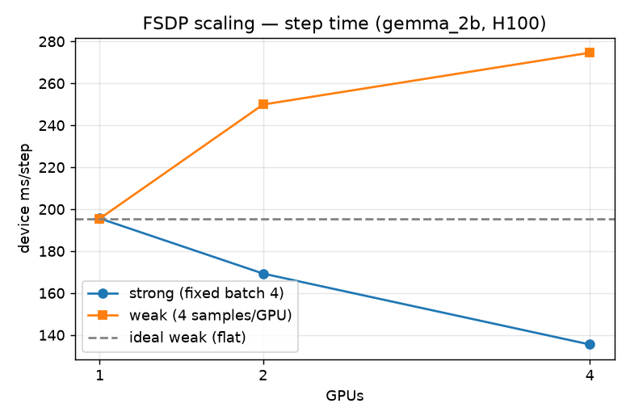
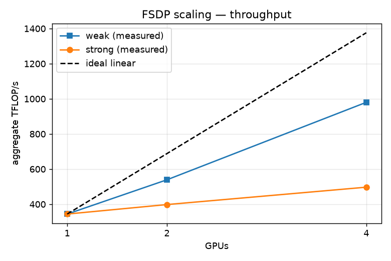
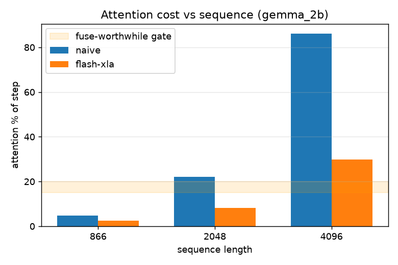
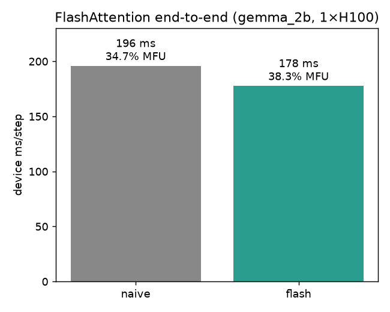
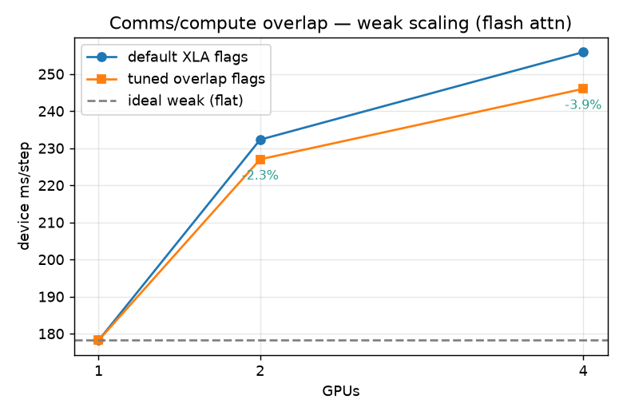

<!-- SHARDER BANNER -->
> This is not upstream openpi. This repository vendors a copy of Physical Intelligence's openpi as the working
> tree for Sharder, a fault-tolerant, multi-host JAX training path. See [SHARDER.md](SHARDER.md) and
> [PLAN.md](PLAN.md). The original from-scratch JAX recreation lives on the `scaffold` branch. The upstream
> README follows below, unmodified.

---

# Sharder: fault-tolerant multi-host JAX training for openpi

Sharder adds a multi-host, fault-tolerant training path to openpi. The guiding constraint throughout is that an
optimization is applied only after the bottleneck it targets has been measured. The numbers below were collected
on a 4× H100 80GB node (gemma_2b, bf16); the correctness tests run on a CPU and localhost multi-process ladder.
Provenance for each figure is in [FINDINGS.md](FINDINGS.md), [STEP_BREAKDOWN.md](STEP_BREAKDOWN.md),
[MULTIHOST_VALIDATION.md](MULTIHOST_VALIDATION.md), and [CHANGES.md](CHANGES.md).
`python scripts/plot_results.py` regenerates every figure from the measured data.

**Project site with animated internals and results: https://virkvarjun.github.io/OpenPI-GPU/**

## Summary

| Result | Measurement | Source |
|---|---|---|
| gemma_2b single-GPU step | 32% MFU (211 ms, batch 4, full AdamW), GEMM-bound | `STEP_BREAKDOWN.md` |
| FlashAttention (default) | 9.3% faster end-to-end (34.7 to 38.3% MFU), numerically equivalent | `flash_end_to_end.png` |
| FSDP weak scaling | 2.85× on 4 GPUs at 24.8% MFU (980 TFLOP/s) | `fsdp_scaling_*.png` |
| FSDP strong scaling | 1.44× on 4 GPUs, comms-bound at batch 4 | `fsdp_scaling_*.png` |
| Comms/compute overlap | +2.3% at 2 GPUs, +3.9% at 4 GPUs (tuned XLA flags) | `comms_overlap.png` |
| Fault tolerance | exact resume (G4) and elastic restart (G5), tested | `elastic_launch_test.py` |
| Test suite (cheap ladder) | 36 passing | `src/openpi/training/*_test.py` |

## 1. Step-time attribution

Device time is attributed per HLO category by an instrument in
[`attribution.py`](src/openpi/training/attribution.py). It corrects two measurement errors present in a naive
profiling setup: summing Chrome-trace op durations undercounts device time by roughly 12×, and `cost_analysis`
underreports FLOPs by roughly 100×. The corrected breakdown of one gemma_2b step (1× H100, batch 4, full AdamW):

| category | % of device time |
|---|---:|
| matmul-FFN | 57.7% |
| other (AdamW, flow-matching, RNG, action expert) | 34.4% |
| vision (SigLIP) | 4.8% |
| embedding | 3.0% |
| attention | ~0% in trace; 4.7% by ablation (Section 3) |

The step is compute-bound and GEMM-saturated at 32% MFU, so there is no headroom in the single-GPU step itself
and throughput has to come from parallelism. Candidate optimizations that were tested and rejected on the
measurements include batched host-to-device transfer and input-pipeline restructuring
([H2D_SPLIT.md](H2D_SPLIT.md), [DISPATCH_PROFILE.md](DISPATCH_PROFILE.md)).

## 2. FSDP scaling

FSDP is applied with `sharding.fsdp_sharding` across 1, 2, and 4 H100s
([`profile_fsdp.py`](scripts/profile_fsdp.py)). Strong scaling holds the global batch fixed at 4; weak scaling
holds the per-GPU batch fixed at 4.

| | 1 GPU | 2 GPU | 4 GPU |
|---|---|---|---|
| strong (fixed batch 4), ms / MFU | 195.6 / 34.7% | 169.3 / 20.1% | 135.5 / 12.5% |
| weak (4 samples/GPU), ms / MFU | 195.5 / 34.8% | 249.9 / 27.2% | 274.6 / 24.8% |
| weak aggregate | 344 | 539 | 980 TFLOP/s |




Under strong scaling the per-GPU batch shrinks to a single sample at 4 GPUs, at which point the parameter
all-gather dominates and per-GPU MFU falls to 12.5%. Weak scaling keeps each device saturated and reaches 2.85×
aggregate throughput on 4 GPUs at 24.8% MFU. FSDP shards parameter memory effectively but requires enough per-GPU
compute to overlap the collective.

## 3. Attention cost and FlashAttention

Trace-based attribution assigns attention close to 0% of the step. This is an artifact of fusion: on GPU, XLA
folds gemma's masked softmax into the adjacent einsum and charges the fused time to the matmul category. The true
cost is recovered by direct ablation at fixed shapes ([`profile_attention.py`](scripts/profile_attention.py)),
and scales with the square of sequence length:

| sequence | naive attn % of step | flash-xla | naive attn-matrix memory |
|---:|---:|---:|---:|
| 866 (current pi0) | 4.7% | 2.4% | 0.14 GB/layer |
| 2048 | 22% | 8.3% | 0.81 GB/layer |
| 4096 | 86% | 30% | 3.22 GB/layer |



FlashAttention (`jax.nn.dot_product_attention`) is wired into gemma under the `use_flash_attention` flag, enabled
by default. It is numerically equivalent to the naive path for both training and inference, with loss parity to
bit precision ([`pi0_flash_test.py`](src/openpi/models/pi0_flash_test.py)). End-to-end on gemma_2b:



The measured reduction is 9.3% (195.9 ms to 177.6 ms, 34.7% to 38.3% MFU), larger than the forward-only ablation
predicts. The backward pass accounts for the difference: the naive path stores and differentiates the full T×S
score matrix, whereas the fused kernel recomputes it. Two limitations apply. The cuDNN flash kernel rejects
gemma_2b's head dim of 256 (it supports at most 128), so the XLA implementation is used. PagedAttention is
specific to autoregressive inference with a KV cache and does not apply to the training step.

## 4. Comms/compute overlap

The residual weak-scaling gap is the portion of the FSDP all-gather and reduce-scatter that is not overlapped
with compute. A tuned XLA flag set ([`fsdp_xla_flags.sh`](scripts/fsdp_xla_flags.sh): latency-hiding scheduler,
pipelined async collectives, large collective-combine thresholds) is compared against the defaults under weak
scaling with FlashAttention enabled:

| GPUs | default | tuned | gain |
|---:|---:|---:|---:|
| 2 | 232.3 ms | 227.0 ms | 2.3% |
| 4 | 255.9 ms | 246.0 ms | 3.9% (1094 TFLOP/s) |



The improvement is small and grows with device count. Recent jaxlib already overlaps most collectives by default,
so the remaining gap is largely the fraction of the collective that cannot be hidden rather than a tuning
deficiency.

## 5. Fault tolerance

G4, exact resume: the data sampler is deterministic, so the example order is a pure function of `(seed, epoch)`.
The train-step counter alone therefore fixes the resume position, and no iterator state is checkpointed.
Cross-epoch continuity is covered by a test.

G5, elastic restart: [`elastic_launch.py`](scripts/elastic_launch.py) restarts training from the last checkpoint
when a process dies. A fault-injection test exercises the crash, restart, and exact-resume path.

## Reproduce

```bash
# figures, from the measured numbers
python scripts/plot_results.py
# on a GPU node
python scripts/profile_step_breakdown.py --variant gemma_2b --batch-size 4 --optimizer none        # step and MFU
python scripts/profile_attention.py --seqs 866 2048 4096                                            # attention ablation
CUDA_VISIBLE_DEVICES=0,1,2,3 python scripts/profile_fsdp.py --batch-size 16                          # FSDP weak scaling
source scripts/fsdp_xla_flags.sh && CUDA_VISIBLE_DEVICES=0,1,2,3 python scripts/profile_fsdp.py --batch-size 16  # with overlap
# cheap-ladder tests on CPU and localhost multi-process
pytest src/openpi/training src/openpi/models/pi0_flash_test.py scripts/elastic_launch_test.py
```

## Status and limitations

The implementation is validated on a single multi-GPU node and is additive: with a single host and no profiling
or resume, the training path is byte-for-byte identical to upstream openpi. Three items remain. Cross-process
NCCL collectives hung on the test node, which is consistent with an environment issue rather than a code defect,
so multi-node training is not yet demonstrated. RLDS resume is coarse. A full convergence run has not been
performed, since it requires base checkpoints and a real dataset.

---

# openpi

openpi holds open-source models and packages for robotics, published by the [Physical Intelligence team](https://www.physicalintelligence.company/).

Currently, this repo contains three types of models:
- the [π₀ model](https://www.physicalintelligence.company/blog/pi0), a flow-based vision-language-action model (VLA).
- the [π₀-FAST model](https://www.physicalintelligence.company/research/fast), an autoregressive VLA, based on the FAST action tokenizer.
- the [π₀.₅ model](https://www.physicalintelligence.company/blog/pi05), an upgraded version of π₀ with better open-world generalization trained with [knowledge insulation](https://www.physicalintelligence.company/research/knowledge_insulation). Note that, in this repository, we currently only support the flow matching head for both $\pi_{0.5}$ training and inference.

For all models, we provide _base model_ checkpoints, pre-trained on 10k+ hours of robot data, and examples for using them out of the box or fine-tuning them to your own datasets.

This is an experiment: $\pi_0$ was developed for our own robots, which differ from the widely used platforms such as [ALOHA](https://tonyzhaozh.github.io/aloha/) and [DROID](https://droid-dataset.github.io/), and though we are optimistic that researchers and practitioners will be able to run creative new experiments adapting $\pi_0$ to their own platforms, we do not expect every such attempt to be successful. All this is to say: $\pi_0$ may or may not work for you, but you are welcome to try it and see!

## Updates

- [Sept 2025] We released PyTorch support in openpi.
- [Sept 2025] We released pi05, an upgraded version of pi0 with better open-world generalization.
- [Sept 2025]: We have added an [improved idle filter](examples/droid/README_train.md#data-filtering) for DROID training.
- [Jun 2025]: We have added [instructions](examples/droid/README_train.md) for using `openpi` to train VLAs on the full [DROID dataset](https://droid-dataset.github.io/). This is an approximate open-source implementation of the training pipeline used to train pi0-FAST-DROID. 


## Requirements

To run the models in this repository, you will need an NVIDIA GPU with at least the following specifications. These estimations assume a single GPU, but you can also use multiple GPUs with model parallelism to reduce per-GPU memory requirements by configuring `fsdp_devices` in the training config. Please also note that the current training script does not yet support multi-node training.

| Mode               | Memory Required | Example GPU        |
| ------------------ | --------------- | ------------------ |
| Inference          | > 8 GB          | RTX 4090           |
| Fine-Tuning (LoRA) | > 22.5 GB       | RTX 4090           |
| Fine-Tuning (Full) | > 70 GB         | A100 (80GB) / H100 |

The repo has been tested with Ubuntu 22.04, we do not currently support other operating systems.

## Installation

When cloning this repo, make sure to update submodules:

```bash
git clone --recurse-submodules git@github.com:Physical-Intelligence/openpi.git

# Or if you already cloned the repo:
git submodule update --init --recursive
```

We use [uv](https://docs.astral.sh/uv/) to manage Python dependencies. See the [uv installation instructions](https://docs.astral.sh/uv/getting-started/installation/) to set it up. Once uv is installed, run the following to set up the environment:

```bash
GIT_LFS_SKIP_SMUDGE=1 uv sync
GIT_LFS_SKIP_SMUDGE=1 uv pip install -e .
```

NOTE: `GIT_LFS_SKIP_SMUDGE=1` is needed to pull LeRobot as a dependency.

**Docker**: As an alternative to uv installation, we provide instructions for installing openpi using Docker. If you encounter issues with your system setup, consider using Docker to simplify installation. See [Docker Setup](docs/docker.md) for more details.


## Model Checkpoints

### Base Models
We provide multiple base VLA model checkpoints. These checkpoints have been pre-trained on 10k+ hours of robot data, and can be used for fine-tuning.

| Model        | Use Case    | Description                                                                                                 | Checkpoint Path                                |
| ------------ | ----------- | ----------------------------------------------------------------------------------------------------------- | ---------------------------------------------- |
| $\pi_0$      | Fine-Tuning | Base [π₀ model](https://www.physicalintelligence.company/blog/pi0) for fine-tuning                | `gs://openpi-assets/checkpoints/pi0_base`      |
| $\pi_0$-FAST | Fine-Tuning | Base autoregressive [π₀-FAST model](https://www.physicalintelligence.company/research/fast) for fine-tuning | `gs://openpi-assets/checkpoints/pi0_fast_base` |
| $\pi_{0.5}$    | Fine-Tuning | Base [π₀.₅ model](https://www.physicalintelligence.company/blog/pi05) for fine-tuning    | `gs://openpi-assets/checkpoints/pi05_base`      |

### Fine-Tuned Models
We also provide "expert" checkpoints for various robot platforms and tasks. These models are fine-tuned from the base models above and intended to run directly on the target robot. These may or may not work on your particular robot. Since these checkpoints were fine-tuned on relatively small datasets collected with more widely available robots, such as ALOHA and the DROID Franka setup, they might not generalize to your particular setup, though we found some of these, especially the DROID checkpoint, to generalize quite broadly in practice.

| Model                    | Use Case    | Description                                                                                                                                                                                              | Checkpoint Path                                       |
| ------------------------ | ----------- | -------------------------------------------------------------------------------------------------------------------------------------------------------------------------------------------------------- | ----------------------------------------------------- |
| $\pi_0$-FAST-DROID       | Inference   | $\pi_0$-FAST model fine-tuned on the [DROID dataset](https://droid-dataset.github.io/): can perform a wide range of simple table-top manipulation tasks 0-shot in new scenes on the DROID robot platform | `gs://openpi-assets/checkpoints/pi0_fast_droid`       |
| $\pi_0$-DROID            | Fine-Tuning | $\pi_0$ model fine-tuned on the [DROID dataset](https://droid-dataset.github.io/): faster inference than $\pi_0$-FAST-DROID, but may not follow language commands as well                                | `gs://openpi-assets/checkpoints/pi0_droid`            |
| $\pi_0$-ALOHA-towel      | Inference   | $\pi_0$ model fine-tuned on internal [ALOHA](https://tonyzhaozh.github.io/aloha/) data: can fold diverse towels 0-shot on ALOHA robot platforms                                                          | `gs://openpi-assets/checkpoints/pi0_aloha_towel`      |
| $\pi_0$-ALOHA-tupperware | Inference   | $\pi_0$ model fine-tuned on internal [ALOHA](https://tonyzhaozh.github.io/aloha/) data: can unpack food from a tupperware container                                                                                                             | `gs://openpi-assets/checkpoints/pi0_aloha_tupperware` |
| $\pi_0$-ALOHA-pen-uncap  | Inference   | $\pi_0$ model fine-tuned on public [ALOHA](https://dit-policy.github.io/) data: can uncap a pen                                                                                                          | `gs://openpi-assets/checkpoints/pi0_aloha_pen_uncap`  |
| $\pi_{0.5}$-LIBERO      | Inference   | $\pi_{0.5}$ model fine-tuned for the [LIBERO](https://libero-project.github.io/datasets) benchmark: gets state-of-the-art performance (see [LIBERO README](examples/libero/README.md)) | `gs://openpi-assets/checkpoints/pi05_libero`      |
| $\pi_{0.5}$-DROID      | Inference / Fine-Tuning | $\pi_{0.5}$ model fine-tuned on the [DROID dataset](https://droid-dataset.github.io/) with [knowledge insulation](https://www.physicalintelligence.company/research/knowledge_insulation): fast inference and good language-following | `gs://openpi-assets/checkpoints/pi05_droid`      |


By default, checkpoints are automatically downloaded from `gs://openpi-assets` and are cached in `~/.cache/openpi` when needed. You can overwrite the download path by setting the `OPENPI_DATA_HOME` environment variable.


## Running Inference for a Pre-Trained Model

Our pre-trained model checkpoints can be run with a few lines of code (here our $\pi_0$-FAST-DROID model):
```python
from openpi.training import config as _config
from openpi.policies import policy_config
from openpi.shared import download

config = _config.get_config("pi05_droid")
checkpoint_dir = download.maybe_download("gs://openpi-assets/checkpoints/pi05_droid")

# Create a trained policy.
policy = policy_config.create_trained_policy(config, checkpoint_dir)

# Run inference on a dummy example.
example = {
    "observation/exterior_image_1_left": ...,
    "observation/wrist_image_left": ...,
    ...
    "prompt": "pick up the fork"
}
action_chunk = policy.infer(example)["actions"]
```
You can also test this out in the [example notebook](examples/inference.ipynb).

We provide detailed step-by-step examples for running inference of our pre-trained checkpoints on [DROID](examples/droid/README.md) and [ALOHA](examples/aloha_real/README.md) robots.

**Remote Inference**: We provide [examples and code](docs/remote_inference.md) for running inference of our models **remotely**: the model can run on a different server and stream actions to the robot via a websocket connection. This makes it easy to use more powerful GPUs off-robot and keep robot and policy environments separate.

**Test inference without a robot**: We provide a [script](examples/simple_client/README.md) for testing inference without a robot. This script will generate a random observation and run inference with the model. See [here](examples/simple_client/README.md) for more details.


## Fine-Tuning Base Models on Your Own Data

We will fine-tune the $\pi_{0.5}$ model on the [LIBERO dataset](https://libero-project.github.io/datasets) as a running example for how to fine-tune a base model on your own data. We will explain three steps:
1. Convert your data to a LeRobot dataset (which we use for training)
2. Defining training configs and running training
3. Spinning up a policy server and running inference

### 1. Convert your data to a LeRobot dataset

We provide a minimal example script for converting LIBERO data to a LeRobot dataset in [`examples/libero/convert_libero_data_to_lerobot.py`](examples/libero/convert_libero_data_to_lerobot.py). You can easily modify it to convert your own data! You can download the raw LIBERO dataset from [here](https://huggingface.co/datasets/openvla/modified_libero_rlds), and run the script with:

```bash
uv run examples/libero/convert_libero_data_to_lerobot.py --data_dir /path/to/your/libero/data
```

**Note:** If you just want to fine-tune on LIBERO, you can skip this step, because our LIBERO fine-tuning configs point to a pre-converted LIBERO dataset. This step is merely an example that you can adapt to your own data.

### 2. Defining training configs and running training

To fine-tune a base model on your own data, you need to define configs for data processing and training. We provide example configs with detailed comments for LIBERO below, which you can modify for your own dataset:

- [`LiberoInputs` and `LiberoOutputs`](src/openpi/policies/libero_policy.py): Defines the data mapping from the LIBERO environment to the model and vice versa. Will be used for both, training and inference.
- [`LeRobotLiberoDataConfig`](src/openpi/training/config.py): Defines how to process raw LIBERO data from LeRobot dataset for training.
- [`TrainConfig`](src/openpi/training/config.py): Defines fine-tuning hyperparameters, data config, and weight loader.

We provide example fine-tuning configs for [π₀](src/openpi/training/config.py), [π₀-FAST](src/openpi/training/config.py), and [π₀.₅](src/openpi/training/config.py) on LIBERO data.

Before we can run training, we need to compute the normalization statistics for the training data. Run the script below with the name of your training config:

```bash
uv run scripts/compute_norm_stats.py --config-name pi05_libero
```

Now we can kick off training with the following command (the `--overwrite` flag is used to overwrite existing checkpoints if you rerun fine-tuning with the same config):

```bash
XLA_PYTHON_CLIENT_MEM_FRACTION=0.9 uv run scripts/train.py pi05_libero --exp-name=my_experiment --overwrite
```

The command will log training progress to the console and save checkpoints to the `checkpoints` directory. You can also monitor training progress on the Weights & Biases dashboard. For maximally using the GPU memory, set `XLA_PYTHON_CLIENT_MEM_FRACTION=0.9` before running training -- this enables JAX to use up to 90% of the GPU memory (vs. the default of 75%).

**Note:** We provide functionality for *reloading* normalization statistics for state / action normalization from pre-training. This can be beneficial if you are fine-tuning to a new task on a robot that was part of our pre-training mixture. For more details on how to reload normalization statistics, see the [norm_stats.md](docs/norm_stats.md) file.

### 3. Spinning up a policy server and running inference

Once training is complete, we can run inference by spinning up a policy server and then querying it from a LIBERO evaluation script. Launching a model server is easy (we use the checkpoint for iteration 20,000 for this example, modify as needed):

```bash
uv run scripts/serve_policy.py policy:checkpoint --policy.config=pi05_libero --policy.dir=checkpoints/pi05_libero/my_experiment/20000
```

This will spin up a server that listens on port 8000 and waits for observations to be sent to it. We can then run an evaluation script (or robot runtime) that queries the server.

For running the LIBERO eval in particular, we provide (and recommend using) a Dockerized workflow that handles both the policy server and the evaluation script together. See the [LIBERO README](examples/libero/README.md) for more details.

If you want to embed a policy server call in your own robot runtime, we have a minimal example of how to do so in the [remote inference docs](docs/remote_inference.md).


### More Examples

We provide more examples for how to fine-tune and run inference with our models on the ALOHA platform in the following READMEs:
- [ALOHA Simulator](examples/aloha_sim)
- [ALOHA Real](examples/aloha_real)
- [UR5](examples/ur5)

## PyTorch Support

openpi now provides PyTorch implementations of π₀ and π₀.₅ models alongside the original JAX versions! The PyTorch implementation has been validated on the LIBERO benchmark (both inference and finetuning). A few features are currently not supported (this may change in the future):

- The π₀-FAST model
- Mixed precision training
- FSDP (fully-sharded data parallelism) training
- LoRA (low-rank adaptation) training
- EMA (exponential moving average) weights during training

### Setup
1. Make sure that you have the latest version of all dependencies installed: `uv sync`

2. Double check that you have transformers 4.53.2 installed: `uv pip show transformers`

3. Apply the transformers library patches:
   ```bash
   cp -r ./src/openpi/models_pytorch/transformers_replace/* .venv/lib/python3.11/site-packages/transformers/
   ```

This overwrites several files in the transformers library with necessary model changes: 1) supporting AdaRMS, 2) correctly controlling the precision of activations, and 3) allowing the KV cache to be used without being updated.

**WARNING**: With the default uv link mode (hardlink), this will permanently affect the transformers library in your uv cache, meaning the changes will survive reinstallations of transformers and could even propagate to other projects that use transformers. To fully undo this operation, you must run `uv cache clean transformers`.

### Converting JAX Models to PyTorch

To convert a JAX model checkpoint to PyTorch format:

```bash
uv run examples/convert_jax_model_to_pytorch.py \
    --checkpoint_dir /path/to/jax/checkpoint \
    --config_name <config name> \
    --output_path /path/to/converted/pytorch/checkpoint
```

### Running Inference with PyTorch

The PyTorch implementation uses the same API as the JAX version - you only need to change the checkpoint path to point to the converted PyTorch model:

```python
from openpi.training import config as _config
from openpi.policies import policy_config
from openpi.shared import download

config = _config.get_config("pi05_droid")
checkpoint_dir = "/path/to/converted/pytorch/checkpoint"

# Create a trained policy (automatically detects PyTorch format)
policy = policy_config.create_trained_policy(config, checkpoint_dir)

# Run inference (same API as JAX)
action_chunk = policy.infer(example)["actions"]
```

### Policy Server with PyTorch

The policy server works identically with PyTorch models - just point to the converted checkpoint directory:

```bash
uv run scripts/serve_policy.py policy:checkpoint \
    --policy.config=pi05_droid \
    --policy.dir=/path/to/converted/pytorch/checkpoint
```

### Finetuning with PyTorch

To finetune a model in PyTorch:

1. Convert the JAX base model to PyTorch format:
   ```bash
   uv run examples/convert_jax_model_to_pytorch.py \
       --config_name <config name> \
       --checkpoint_dir /path/to/jax/base/model \
       --output_path /path/to/pytorch/base/model
   ```

2. Specify the converted PyTorch model path in your config using `pytorch_weight_path`

3. Launch training using one of these modes:

```bash
# Single GPU training:
uv run scripts/train_pytorch.py <config_name> --exp_name <run_name> --save_interval <interval>

# Example:
uv run scripts/train_pytorch.py debug --exp_name pytorch_test
uv run scripts/train_pytorch.py debug --exp_name pytorch_test --resume  # Resume from latest checkpoint

# Multi-GPU training (single node):
uv run torchrun --standalone --nnodes=1 --nproc_per_node=<num_gpus> scripts/train_pytorch.py <config_name> --exp_name <run_name>

# Example:
uv run torchrun --standalone --nnodes=1 --nproc_per_node=2 scripts/train_pytorch.py pi0_aloha_sim --exp_name pytorch_ddp_test
uv run torchrun --standalone --nnodes=1 --nproc_per_node=2 scripts/train_pytorch.py pi0_aloha_sim --exp_name pytorch_ddp_test --resume

# Multi-Node Training:
uv run torchrun \
    --nnodes=<num_nodes> \
    --nproc_per_node=<gpus_per_node> \
    --node_rank=<rank_of_node> \
    --master_addr=<master_ip> \
    --master_port=<port> \
    scripts/train_pytorch.py <config_name> --exp_name=<run_name> --save_interval <interval>
```

### Precision Settings

JAX and PyTorch implementations handle precision as follows:

**JAX:**
1. Inference: most weights and computations in bfloat16, with a few computations in float32 for stability
2. Training: defaults to mixed precision: weights and gradients in float32, (most) activations and computations in bfloat16. You can change to full float32 training by setting `dtype` to float32 in the config.

**PyTorch:**
1. Inference: matches JAX -- most weights and computations in bfloat16, with a few weights converted to float32 for stability
2. Training: supports either full bfloat16 (default) or full float32. You can change it by setting `pytorch_training_precision` in the config. bfloat16 uses less memory but exhibits higher losses compared to float32. Mixed precision is not yet supported.

With torch.compile, inference speed is comparable between JAX and PyTorch.

## Troubleshooting

We will collect common issues and their solutions here. If you encounter an issue, please check here first. If you can't find a solution, please file an issue on the repo (see [here](CONTRIBUTING.md) for guidelines).

| Issue                                     | Resolution                                                                                                                                                                                   |
| ----------------------------------------- | -------------------------------------------------------------------------------------------------------------------------------------------------------------------------------------------- |
| `uv sync` fails with dependency conflicts | Try removing the virtual environment directory (`rm -rf .venv`) and running `uv sync` again. If issues persist, check that you have the latest version of `uv` installed (`uv self update`). |
| Training runs out of GPU memory           | Make sure you set `XLA_PYTHON_CLIENT_MEM_FRACTION=0.9` (or higher) before running training to allow JAX to use more GPU memory. You can also use `--fsdp-devices <n>` where `<n>` is your number of GPUs, to enable [fully-sharded data parallelism](https://engineering.fb.com/2021/07/15/open-source/fsdp/), which reduces memory usage in exchange for slower training (the amount of slowdown depends on your particular setup). If you are still running out of memory, you may want to consider disabling EMA.        |
| Policy server connection errors           | Check that the server is running and listening on the expected port. Verify network connectivity and firewall settings between client and server.                                            |
| Missing norm stats error when training    | Run `scripts/compute_norm_stats.py` with your config name before starting training.                                                                                                          |
| Dataset download fails                    | Check your internet connection. For HuggingFace datasets, ensure you're logged in (`huggingface-cli login`).                                                                                 |
| CUDA/GPU errors                           | Verify NVIDIA drivers are installed correctly. For Docker, ensure nvidia-container-toolkit is installed. Check GPU compatibility. You do NOT need CUDA libraries installed at a system level --- they will be installed via uv. You may even want to try *uninstalling* system CUDA libraries if you run into CUDA issues, since system libraries can sometimes cause conflicts. |
| Import errors when running examples       | Make sure you've installed all dependencies with `uv sync`. Some examples may have additional requirements listed in their READMEs.                    |
| Action dimensions mismatch                | Verify your data processing transforms match the expected input/output dimensions of your robot. Check the action space definitions in your policy classes.                                  |
| Diverging training loss                            | Check the `q01`, `q99`, and `std` values in `norm_stats.json` for your dataset. Certain dimensions that are rarely used can end up with very small `q01`, `q99`, or `std` values, leading to huge states and actions after normalization. You can manually adjust the norm stats as a workaround. |
